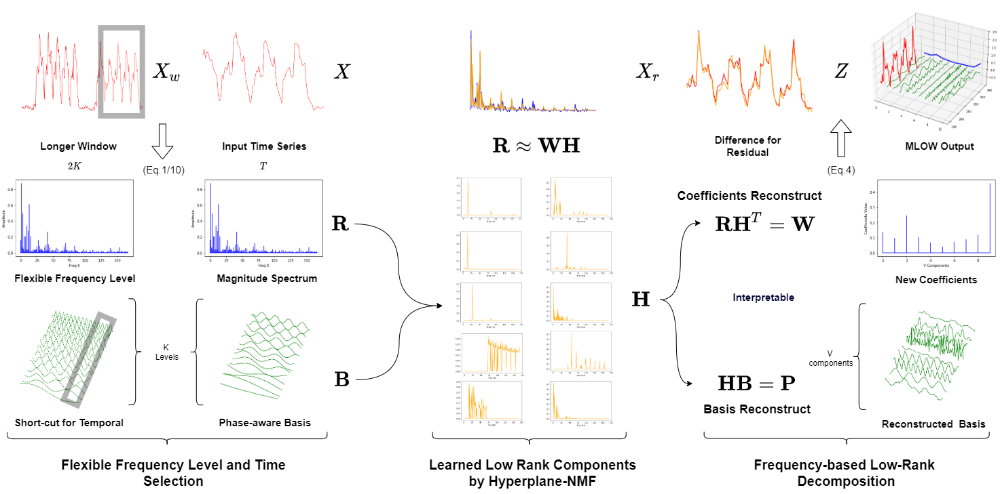
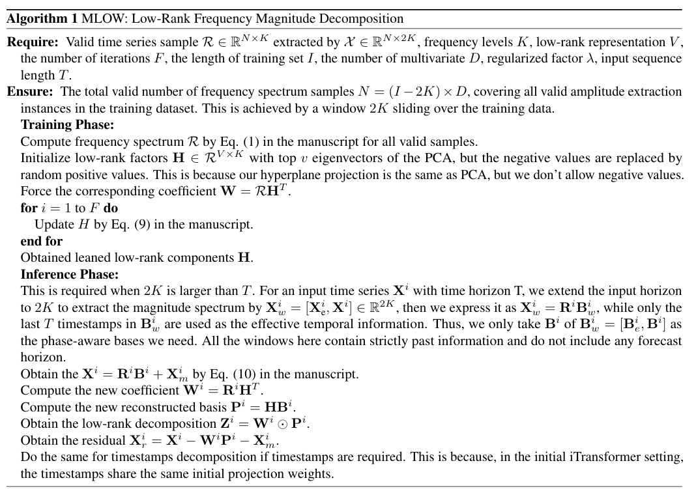
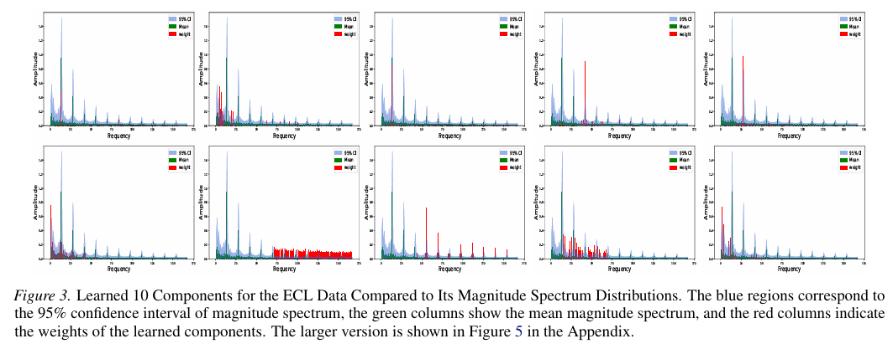
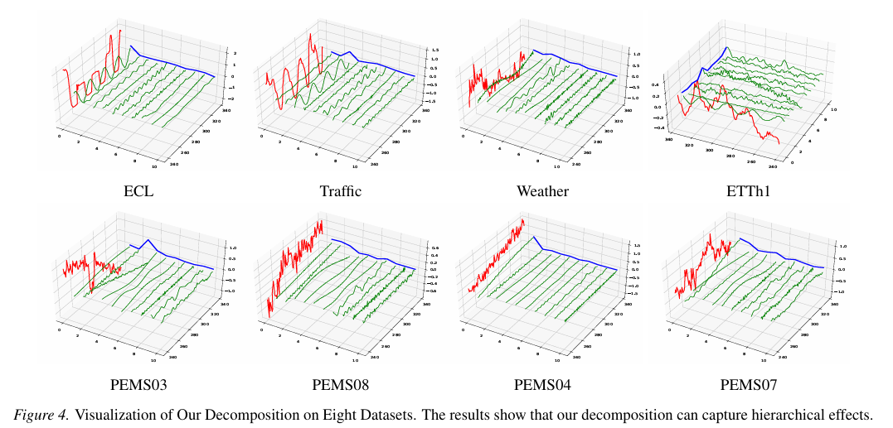
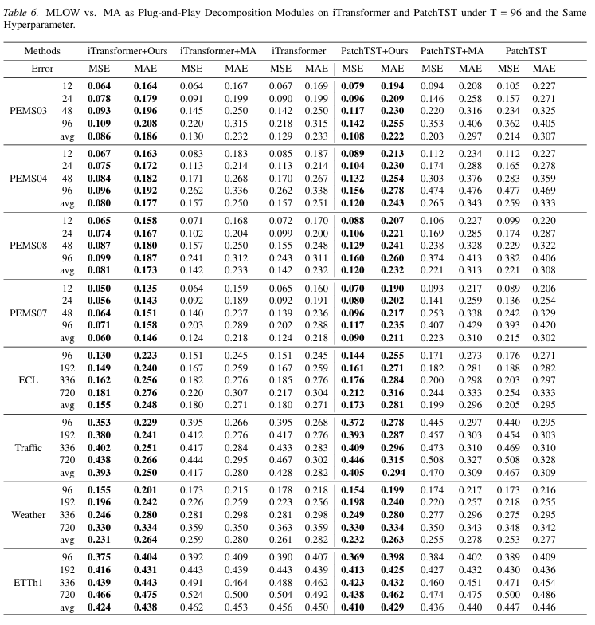
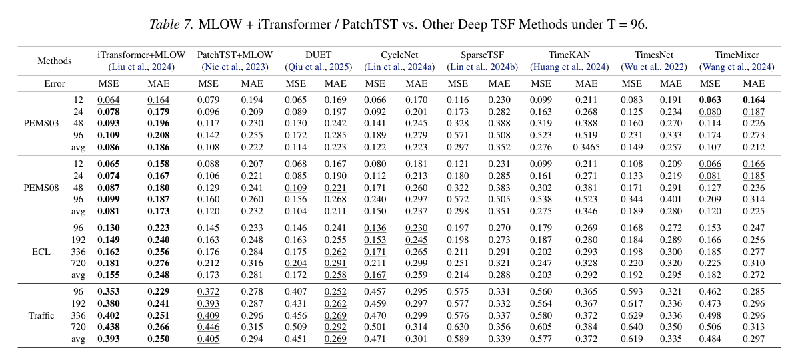

# MLOW: Interpretable Low-Rank Frequency Magnitude Decomposition of Multiple Effects for Time Series Forecasting

[](https://arxiv.org/abs/2603.18432)

This is a PyTorch implementation of the paper: [MLOW: Interpretable Low-Rank Frequency Magnitude Decomposition of Multiple Effects for Time Series Forecasting]().  MLOW is an interpretable Fourier-based decomposition method that disentangles multiple effects of certain time series data using learned low-rank components, providing an interpretable decomposition in the temporal domain rather than operating in the complex frequency domain.

If you find this project helpful, please don't forget to give it a ⭐ Star. Thank you very much! 

We'll keep updating this repository with new features and news. Please feel free to contact us if you have any questions or find any bugs. 

### 📰 News: We have added two more models, NLinear and CycleNet, to allow you to experiment with.

### 📰 News: We have provided a simplified code version with bounded time-frequency for you to use in folder "A simpler version with bounded time-frequency", where K must be equal to T/2. This operation is conducted outside the dataloader to make it easier for you to transfer our code to your repository.

## 🧠 Inference

### Overview Pipeline
A mathematical mechanism enables flexible selection of initial frequency levels and the input horizon. The inference pipeline allows users to choose the initial frequency level, input horizon, and low-rank components, which are represented as "frequency_level", "seq_len", and "rank" in the run.py file. The visualization of the pipeline is provided as follows:
[](./fig/Decomposition.pdf)

### Low Rank Algorithm
A low-rank learning method for Frequency Magnitude, Hyperplane-NMF, is proposed. A regularization parameter is used, which is represented as "lamb" in the run.py file. For implementation details, please refer to the code in ./data_provider/data_loader.py. The training and inference pseudocode are as follows:



## 🚀 Training
### Environment
You can install the enviornment by runing the following code
```
pip install -r requirements.txt
```
## Dataset
You can obtained the well pre-processed datasets from [Google Drive](https://drive.google.com/file/d/1vgpOmAygokoUt235piWKUjfwao6KwLv7/view?usp=drive_link) or [Baidu Drive](https://pan.baidu.com/s/1ycq7ufOD2eFOjDkjr0BfSg?pwd=bpry). Then place the downloaded data under the folder `./dataset`. 

## Reproduce the Results 
We provide the learned low-rank components obtained by the implemented algorithms in "NMF" folder, and we fix the random seed in run.py, allowing you to reproduce the exact same low-rank components. If you want to directly use these components, you can set optimize_H_from_scratch to False. Here, you can implement MLOW with PatchTST and iTransformer using the following code to reproduce the results in the paper.

```
sh ./scripts/long_term_forecast/ETTh1.sh
sh ./scripts/short_term_forecast/PEMS.sh
```


## 📊 Evaluation
## The visualization of the learned low rank components.


## The visualization of the MLOW Decompostion.

## The Experiment Results.



## ❗ Common Issues
If you run into any issues, please let us know. One common issue is memory usage. Our decomposition is precomputed in the dataloader, which is more efficient. However, if your GPU memory cannot handle it, you can use our pretrained low-rank components and move the decomposition proccess to the model initialization stage.

## 📚 Citation

If you find MLOW useful for your research or applications, please cite our paper using the following BibTeX:

```bibtex
  @article{yang2026mlow,
      title={MLOW: Interpretable Low-Rank Frequency Magnitude Decomposition of Multiple Effects for Time Series Forecasting}, 
      author={Runze Yang and Longbing Cao and Xiao-Ming Wu and Xin You and Kun Fang and Jianxun Li and Jie Yang},
      journal={arXiv preprint arXiv:2603.18432},
      year={2026},
  }
```
If you have any questions or suggestions, feel free to contact:

Runze Yang (runze.y@sjtu.edu.cn)

